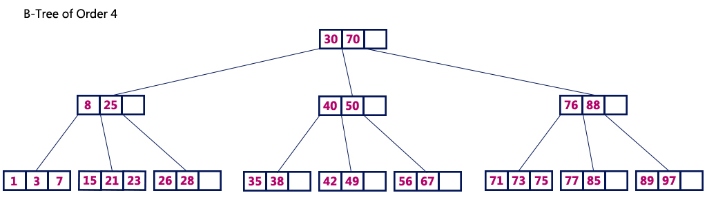
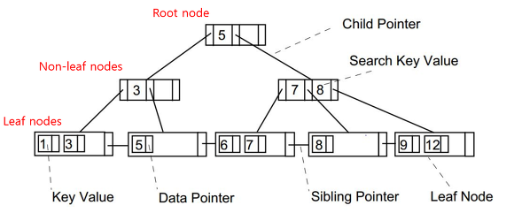

## Index란?

## Index란?
- 우리말로 색인, 쉽게 찾아볼 수 있도록 일정한 순서에 따라 놓은 목록

## DB의 Index
- 데이터베이스에서 조회 및 검색 성능을 향상시키는 자료구조.
  - where 절 등을 통해 활용된다.
  
- DBMS의 인덱스는 항상 정렬된 상태를 유지.
- 하나의 데이터베이스 객체.
- 데이터베이스 크기의 약 10% 정도의 저장공간 필요.

## DB의 스캔 방식
DB의 스캔 방식에는 Full Table Scan과 Index Scan이 있다.

### Full Table Scan

출처 - https://hoon93.tistory.com/53

- 순차적 접근
  - 테이블에 존재하는 모든 데이터를 읽어 가면서 조건에 맞으면 추출, 맞지 않으면 버림
- 접근 비용 감소
 
#### 사용하는 경우
- 적용가능한 인덱스가 없는 경우
- 인덱스 처리 범위가 넓은 경우 (인덱스가 있더라도 처리 범위가 넓어 성능상의 이점이 없을 때)
- 작은 테이블에 접근하는 경우

### Index Scan

출처 - https://hoon93.tistory.com/53

- 인덱스를 구성하는 컬럼 값을 기반으로 데이터를 추출하는 접근 기법

## Index의 알고리즘

### B-Tree
데이터 베이스 인덱스의 기본 구조는 B-Tree(Balanced-Tree)이다. 일반적으로는 B-Tree를 좀 더 개선한 B+Tree가 사용된다.

출처 - http://www.btechsmartclass.com/data_structures/b-trees.html

- 가장 상단의 노드를 **루트 노드(Root Node)**, 중간 노드들을 **브랜치 노드(Branch Node)**, 가장 아래 노드를 **리프 노드(Leaf Node)** 라 한다.
- 이진트리와 유사하지만, 자식 노드를 2개 이상 가질 수 있다.
- 균형 트리이다.
  - 루트로부터 리프까지의 거리가 일정한 트리 구조를 의미 
  - 따라서 탐색 시(select) 시간복잡도 O(logN).
  - 그러나 갱신 시(insert, updete, delete)에는 수시로 정렬을 하기 때문에 성능저하.
  
### B+tree 알고리즘

- 리프 노드만 인덱스와 함께 데이터(Value)를 가진다.
- 나머지 노드들은 데이터를 위한 인덱스(Key)만을 가진다.
- 리프노드들은 LinkedList로 연결되어 있다.
- 데이터 노드 크기는 인덱스 노드의 크기와 같지 않아도 된다.

#### 장점
- b-tree 노드와는 다르게 리프노드들이 LinkedList로 연결되어 있어 한번의 선형 탐색만 하면된다.
- 리프 노드에만 데이터를 담기 때문에 메모리를 더 확보함으로써 더 많은 key들을 수용할 수 있다. 하나의 노드에 더 많은 key들을 담을 수 있기에 트리의 높이는 더 낮아진다.

#### hashtable이 아닌 B+tree 사용 이유
- 왜 index 생성 시 b-tree를 사용할까? hash table이 더 효율적이지 않나? 
  - SELECT 질의 조건에는 부등호 연산(<>)도 포함 
  - hash table은 동등 연산에 특화된 자료구조이기 때문에 부등호 연산 사용 시 문제 발생

## Index의 종류
클러스터링 인덱스와 논-클러스터링 인덱스가 있다.

### 클러스터(Clustre)
- 무리, 군집
- 무리를 이루다

### 클러스터링 인덱스
**실제 데이터와 같은 무리의 인덱스**이다. 테이블에 primary key를 생성하면 클러스터링 인덱스가 자동으로 생성된다.

출처 - https://gwang920.github.io/database/clusterednonclustered/

- 실제 데이터 자체가 정렬된다.
- 데이블당 1개만 존재 가능하다.
- 리프 페이지가 데이터 페이지이다.
- 아래 제약조건 시 자동생성이 된다.
  - primary key
  - unique + not null

### 논-클러스터링 인덱스

출처 - https://gwang920.github.io/database/clusterednonclustered/

**실제 데이터와 다른 무리의 별도의 인덱스**이다. 테이블에 unique key를 생성하면 클러스터링 인덱스가 자동으로 생성된다.

- 실제 데이터 페이지는 그대로다.
- 별도의 인덱스 페이지 생성. 즉, 추가 공간이 필요하다.
- 테이블당 여러 개가 존재할 수 있다.
- 리프 페이지에 실제 데이터 페이지의 **주소**를 담고 있다.
- unique 제약조건 적용시 자동 생성
- 직접 index 생성시 논-클러스터링 인덱스 생성

### 함께 적용한다면? 

출처 - https://velog.io/@gillog/SQL-Clustered-Index-Non-Clustered-Index

두 인덱스가 함께 적용 되는 경우에는 논-클러스터링 인덱스의 리프 페이지에 실제 데이터 페이지 주소가 아닌, 클러스터링 인덱스가 적용된 컬럼의 값이 들어간다.

### 어떤 컬럼에 인덱스를 적용할까?
카디널리티 (=요소의 개수)
- 카디널리티가 높은 것. 다시말해 데이터의 중복도가 낮은 것
- where, join order by 절에 자주 사용되는 컬럼
  - 조건 절이 없으면 인덱스가 사용되지 않기 때문
- insert / update / delete가 자주 발생하지 않는 컬럼
  - b-tree는 갱신 작업 시 성능이 좋지 않다.
- 규모가 작지 않은 테이블

### 참조 자료
- [우테코 - [10분 테코톡] 라라, 제로의 데이터베이스 인덱스](https://youtu.be/edpYzFgHbqs)
- https://github.com/WeareSoft/tech-interview/blob/master/contents/db.md#index%EB%9E%80
- https://hoon93.tistory.com/53
- https://zorba91.tistory.com/293
- https://mangkyu.tistory.com/96
- https://gwang920.github.io/database/clusterednonclustered/